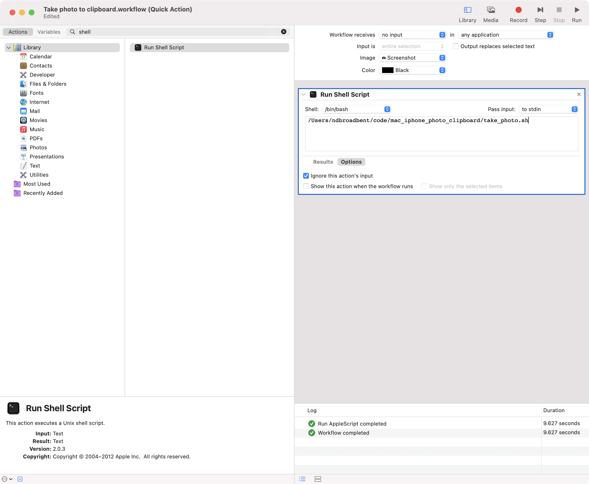
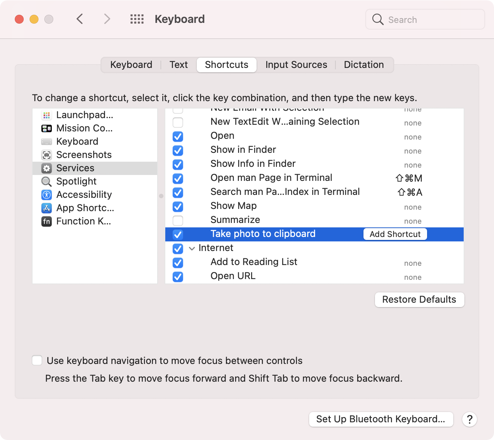

# Mac iPhone Photo Clipboard Shortcut Tool Thing

Answering the question:

[How could I set up a keyboard shortcut on my Mac that will open the camera on my iPhone, then transfer the captured photo to my Mac clipboard?](https://apple.stackexchange.com/questions/425273/how-could-i-set-up-a-keyboard-shortcut-on-my-mac-that-will-open-the-camera-on-my)


## Requirements

Run `./install_dependencies.sh` to install required Homebrew packages.

* MacOS
* Homebrew
* [cliclick](https://github.com/BlueM/cliclick)
  * `brew install cliclick`
* [fswatch](https://emcrisostomo.github.io/fswatch/)
  * `brew install fswatch`

## Usage (Manual)

```
git clone https://github.com/ndbroadbent/mac_iphone_photo_clipboard.git
cd mac_iphone_photo_clipboard
./take_photo.sh
```

## Set Up Keyboard Shortcut

> Tested on MacOS Big Sur (11.4).

* Open Automator
* Create a new "Quick Action"
* Set Workflow receives -> "no input"
* Add "Run Shell Script"
* Enter the full path to the `take_photo.sh` script.
  * For me, this was: `/Users/ndbroadbent/code/mac_iphone_photo_clipboard/take_photo.sh`

> One annoying issue: This seems to require permissions to be accepted for every different 
> application that happens to be open whenever you run the shortcut. 
> For example, if you run the shortcut from Slack, then MacOS will ask you to give Slack the 
> required permissions to control your machine. Same for Google Chrome, Evernote, Finder, etc. 
> It's a bit annoying but you only need to allow the permissions once for each application.

* Save the Automator workflow and call it something like "Take photo to clipboard"



* Run the Automator workflow manually. 
  * Accept all of the permissions requests that pop up.
  * Make sure you check any "Don't ask again" checkboxes if you see any.
  * Set up the "Accessibility Permissions" that it asks for.

* Go to System Preferences -> Keyboard -> Shortcuts



* Click "Add Shortcut" next to "Take photo to clipboard".
* Press some keys to set your keyboard shortcut. 
  * I ended up going with Shift + Option + Cmd + C
* Test out your new shortcut!

## References

* https://www.reddit.com/r/applehelp/comments/bxb6di/how_do_you_quickly_transfer_a_photo_you_snapped/
* https://stackoverflow.com/questions/55078885/calling-finders-import-from-iphone-take-photo-from-shell
* https://apple.stackexchange.com/questions/24063/create-global-shortcut-to-run-command-line-applications
* https://www.reddit.com/r/mac/comments/95dkm2/good_unused_key_combinations_for_global_shortcuts/
* https://apple.stackexchange.com/a/398868/56850
